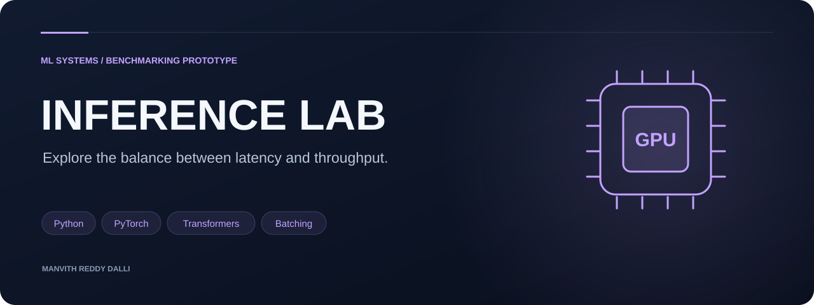
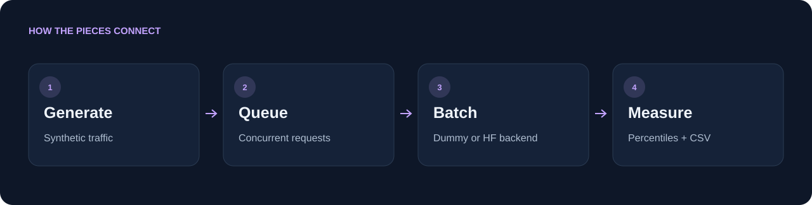

<p align="center"></p>

<h1 align="center">GPU Inference Benchmark</h1>

<p align="center">Explore the balance between latency and throughput.</p>

<p align="center"><code>Python</code> &nbsp; <code>PyTorch</code> &nbsp; <code>Transformers</code> &nbsp; <code>Batching</code></p>

<p align="center"><a href="#architecture">Architecture</a> · <a href="#features">Features</a> · <a href="#quick-start">Quick start</a> · <a href="#technology-and-structure">Technology and structure</a> · <a href="#reading-results">Reading results</a></p>

<table><tr><td width="33%" valign="top"><h3>Controlled traffic</h3><p>Tune arrival rate, concurrency, and request count.</p></td><td width="33%" valign="top"><h3>Two execution paths</h3><p>Compare simulated timing with a Hugging Face adapter.</p></td><td width="33%" valign="top"><h3>Readable measurements</h3><p>Export latency percentiles and throughput to CSV.</p></td></tr></table>

---

A Python benchmarking prototype that generates concurrent language-model requests, groups them through a continuous batching scheduler, and records latency percentiles and throughput. A lightweight simulated backend makes the workflow accessible without a GPU; an optional Hugging Face backend runs model inference.

## Architecture



## Features

- Configurable request count, arrival rate, concurrency, batch size, and batching timeout.
- p50, p90, and p99 latency plus requests/second and tokens/second.
- Appendable CSV output for comparing configurations.
- Simulated quantization and KV-cache effects in the dummy backend.

**Scope:** the dummy backend models timing effects; its results are not measured GPU acceleration. The Hugging Face adapter does not implement the dummy backend’s optimization switches. vLLM and TensorRT are extension ideas, not included integrations.

## Quick start

```sh
git clone https://github.com/Manvith-d/gpu-inference-bench.git
cd gpu-inference-bench
pip install -r requirements.txt
python benchmark.py --backend dummy --users 100 --concurrency 16 --batch-size 8
python benchmark.py --backend dummy --users 100 --quantized --kv-cache
```

The boolean switches are flags: use `--quantized` and `--kv-cache` without a trailing `true`. Results are written to `results/summary.csv` by default.

For actual model inference, install the optional backend dependencies:

```sh
pip install torch transformers
python benchmark.py --backend hf --model distilgpt2 --users 20 --concurrency 4
```

Model weights are downloaded on first use. Inspect the adapter’s device configuration before interpreting a run as GPU performance.

## Technology and structure

| Component | Implementation |
| --- | --- |
| Traffic and coordination | Python, threading, semaphores |
| Batching | `scheduler/continuous_batcher.py` |
| Simulated execution | `backends/dummy_backend.py` |
| Model inference | PyTorch / Transformers in `backends/hf_backend.py` |
| Measurements | `utils/metrics.py` |
| Entry point | `benchmark.py` |

## Reading results

Compare runs using the same backend, model, environment, and traffic settings. Latency starts after acquiring the concurrency slot, so it excludes time waiting for that slot. Token throughput uses the requested output-token count. These choices make the harness useful for exploration, while limiting claims about end-to-end production service performance.

---
Explore more work in [Manvith Reddy Dalli’s portfolio](https://manvith-d.github.io/portfolio/) · [LinkedIn](https://www.linkedin.com/in/manvith-reddy-dalli-38a06a257)
